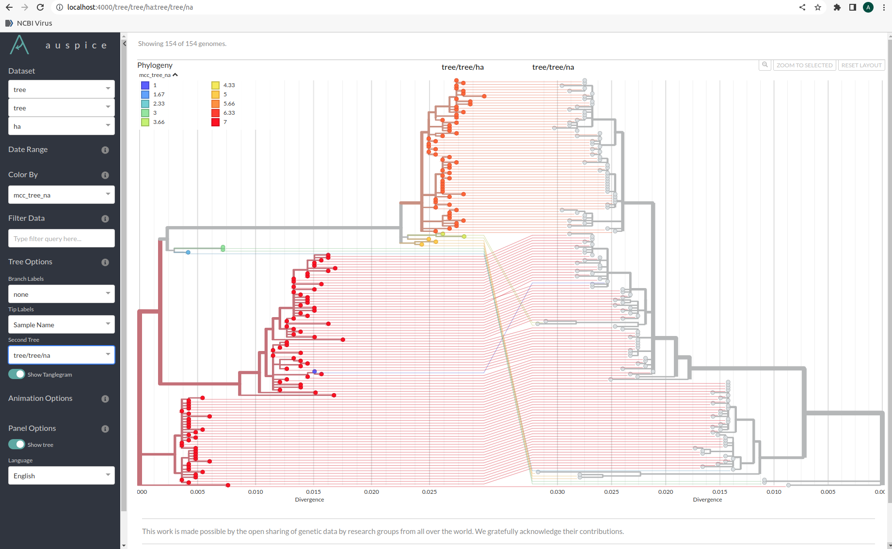

# [Visualizing MCCs](@id visualization)

## Visualizing the ARG
[IcyTree](https://icytree.org/) (Vaughan, T. G., IcyTree: Rapid browser-based visualization for phlogenetic trees and networks. Bioinformatics 2017. DOI: 10.1093/bioinformatics/btx155) is an in-browser application that can be used to view ARGs. Just drag and drop the extended newick file obtained per default at the end of TreeKnit and see the results. 

## [Visualizing MCCs using a Tanglegram] (@id view_auspice)
Tanglegrams are an excellent way to view recombination events between trees. In a tanglegram two trees are joint at the leaves and viewed side by side. Auspice is an excellent option for visualizing recombination events in large trees as it can uniquely color different MCCs allowing for easy comparison of tree topologies. Viewing tanglegrams in Auspice with MCC colorings requires specific files, which will be generated when TreeKnit is run with the `--auspice-view` argument. In julia these files can be produced using the command: `TreeKnit.write_auspice_json(filepath::String, tree1::Tree{T}, tree2::Tree{T}, MCCs::Vector{Vector{String}})`.

In order to view these files [auspice](https://docs.nextstrain.org/projects/auspice/en/stable/index.html) must be installed, this can either be done by following the documentation on their [website](https://docs.nextstrain.org/projects/auspice/en/stable/introduction/install.html) or by running the bash script `auspice_visualization.sh` on the CLI (this requires conda to be installed on your local machine). The commands for running this visualization for the NY dataset in the test folder are as follows:

```bash
treeknit test/tree_ha.nwk test/tree_na.wk --auspice-view --o treeknit_results
cd treeknit_results ##migrate to folder with simulation results
bash ../auspice_visualization.sh tree_ha tree_na ##run the bash scripts with two arguments for the tree names
```
If you have installed auspice manually, run the commands below in your results directory. For more information see the auspice [documentation](https://docs.nextstrain.org/projects/auspice/en/stable/advanced-functionality/second-trees.html) on viewing two trees side by side.

```bash
augur export v2 -t "tree_ha.resolved.nwk" --node-data "branch_lengths_tree_ha.json" --output "tree_tree_ha.json"
augur export v2 -t "tree_na.resolved.nwk" --node-data "branch_lengths_tree_na.json" --output "tree_tree_na.json"
auspice view --datasetDir results_dir
```
After this you should be able to view the tanglegram on http://localhost:4000, select either tree/tree/ha or tree/tree/na from the list and then select the other tree from the `second tree` option at the bottom left of the toggle bar.

The resulting tanglegram should look as follows:

 


